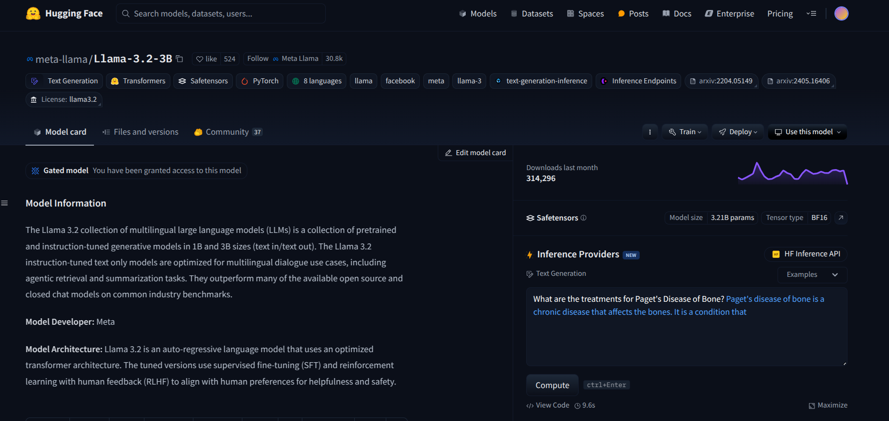
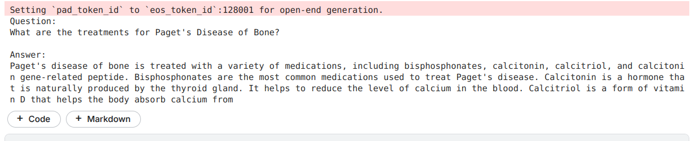

# LLaMA 3.2 - 3B Medical Fine-Tuned Model

## Model Description
This model is a fine-tuned version of the **LLaMA 3.2 - 3B** large language model, optimized for medical question-answering tasks. The fine-tuning was conducted using **Low-Rank Adaptation (LoRA)** on a **Medical QA dataset**.

## Fine-Tuning Approach
LoRA allows for efficient parameter tuning by introducing trainable low-rank matrices that adapt the model weights without modifying the pre-trained parameters extensively.

### LoRA Rank Selection
- The model was trained with **LoRA rank 4**.
- Higher ranks allow for more detailed adaptations but increase computational overhead.
- The initial training was performed with a lower rank for efficiency, with plans to increase rank in future iterations based on performance evaluations.

## Training Configuration
- **Base Model**: LLaMA 3.2 - 3B
- **Dataset**: Medical Question-Answer dataset
- **Training Framework**: Hugging Face `transformers`
- **Optimizer**: AdamW with `fp16` for mixed precision training
- **Batch Size**: 1 (with gradient accumulation of 4)
- **Epochs**: 1
- **Learning Rate**: 2e-5
- **Evaluation & Logging**: Weights & Biases (W&B) integration
- **Model Sharing**: Pushed to Hugging Face Model Hub

## Performance & Metrics
The training logs (attached below) indicate:
- **Loss Reduction**: Training loss gradually decreases, indicating convergence.
- **Learning Rate Decay**: Follows a linear decay schedule.
- **Gradient Norm Stability**: Controlled within acceptable limits.
- **Global Steps & Epoch Tracking**: The model completes training within the expected steps.

### Training Charts


## Usage
To load and use the model:
```python
from transformers import AutoModelForCausalLM, AutoTokenizer

tokenizer = AutoTokenizer.from_pretrained("your-huggingface-username/llama_medical")
model = AutoModelForCausalLM.from_pretrained("your-huggingface-username/llama_medical")

def generate_medical_response(prompt):
    inputs = tokenizer(prompt, return_tensors="pt")
    outputs = model.generate(**inputs)
    return tokenizer.decode(outputs[0], skip_special_tokens=True)

print(generate_medical_response("What are the symptoms of diabetes?"))
```

## Future Improvements
- Increase LoRA rank for improved adaptation.
- Further dataset augmentation for broader generalization.
- Optimize inference for real-time applications in medical AI systems.


## Comparison


